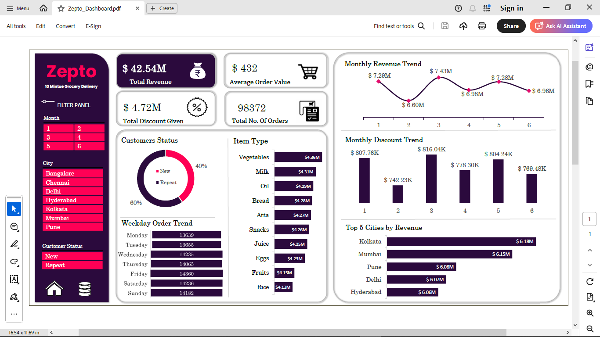
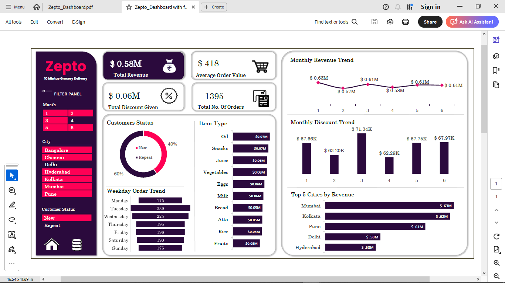

# Zepto-Sales-Dashboard
# 🛍️ Zepto Sales Dashboard | Excel + Power Query Project

This project is a complete **Sales Analysis Dashboard** built in Excel using **98,000+ filtered Zepto order records**. It simulates a real-world quick-commerce scenario and helps answer key business questions using interactive visuals, slicers, and KPI cards.

---

## 📌 Project Objective

To design a data-driven sales dashboard that gives actionable insights into:
- Monthly revenue trends
- Top-performing products & cities
- Customer segmentation (New vs Repeat)
- Discount effectiveness
- Ordering behavior by day of week

---

## 📊 Key KPIs Tracked

- ✅ **Total Revenue**
- ✅ **Total Orders**
- ✅ **Average Order Value (AOV)**
- ✅ **Discount Amount**
- ✅ **New vs Repeat Customer Split**

---

## 🧠 Business Insights Discovered

1. **Vegetables** are the highest-selling category 🥦  
2. **Fridays** have the most orders, **Mondays** the least  
3. **Revenue dips in February and April** — possible customer churn or campaign gaps  
4. **Repeat customers** contribute only ~40% of total orders — opportunity for loyalty programs  
5. Some **cities consistently outperform others**, ideal for scaling logistics and marketing focus  
6. Discounts impact varies across products — optimization recommended

---

## 🛠️ Tools & Features Used

- **Excel** (2021+)
- **Power Query** – Data cleaning, column creation
- **Pivot Tables** – Dynamic aggregations
- **Slicers** – City, Product, Month, Customer Status
- **PivotCharts & KPI Cards**
- **Zepto Brand Colors**:
  - Dark Purple: `#2B0A3D`
  - Pink Accent: `#FF1477`

---

## 🎨 Dashboard Preview

> 
>  

---

## 📁 Files Included

- `Zepto Dashboard.xlsx` – Final Excel file with slicers, KPIs, and all visuals
- `dashboard.png` – Preview image for LinkedIn/GitHub

---

## 👤 About Me

**Mohit Prajapati**  
Aspiring Data Analyst skilled in Excel, SQL, Python, Power BI  
📧 mohitprajapati4095@gmail.com  
🔗 [LinkedIn](www.linkedin.com/in/mohit-prajapati-8565a034b)

---

## 🏷️ Tags

`#ExcelDashboard` `#DataAnalytics` `#PowerQuery` `#Zepto` `#DataVisualization` `#PivotTables` `#PortfolioProject`

